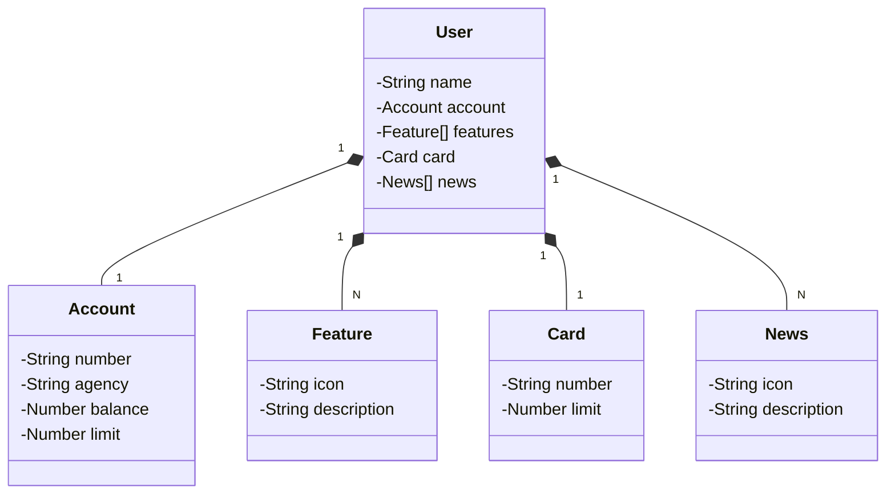

# Santander Dev Week 2023

A Java RESTful API is created for the Santander Dev Week.

## Main Technologies
- **Java 21**: We will use the latest long-term support (LTS) version of Java to take advantage of the latest innovations that this robust and widely used language offers;
- **Spring Boot 3**: We will work with the latest version of Spring Boot, which maximizes developer productivity through its powerful autoconfiguration principle;
- **Spring Data JPA**: We will explore how this tool can simplify our data access layer, facilitating integration with SQL databases;
- **OpenAPI (Swagger)**: We will create an effective and easy-to-understand API documentation using OpenAPI (Swagger), perfectly aligned with the high productivity that Spring Boot offers;
- **Railway**: We will use it to facilitate the deployment and monitoring of our solutions in the cloud, in addition to offering various databases as a service and CI/CD pipelines.
## [Link do Figma](https://www.figma.com/file/0ZsjwjsYlYd3timxqMWlbj/SANTANDER---Projeto-Web%2FMobile?type=design&node-id=1421%3A432&mode=design&t=6dPQuerScEQH0zAn-1)

The Figma was used to abstract the domain of this API, which is useful for analysis and projecting the solution

## Class Diagram (Domain of the API) - mermaid UML

[//]: # (## IMPORTANTE)

